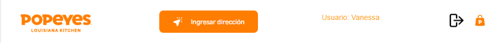
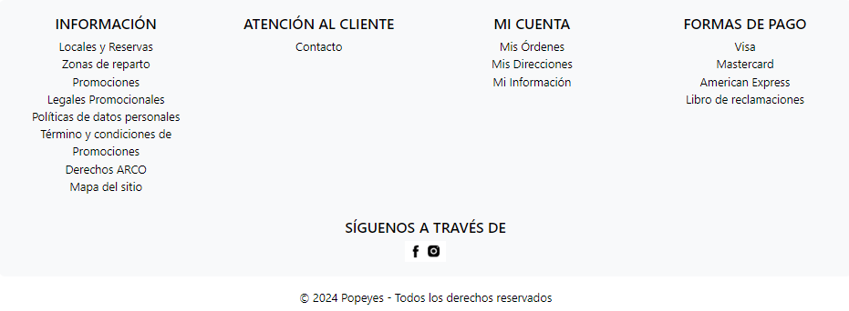
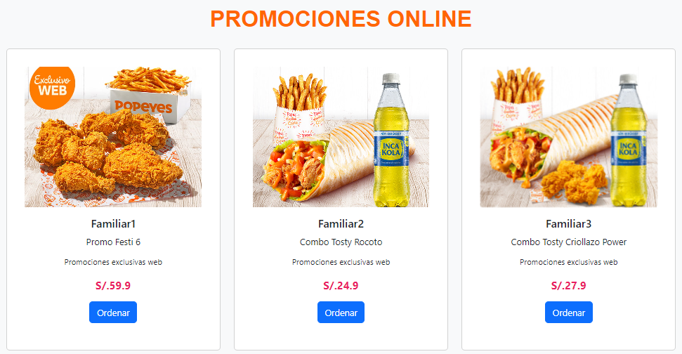
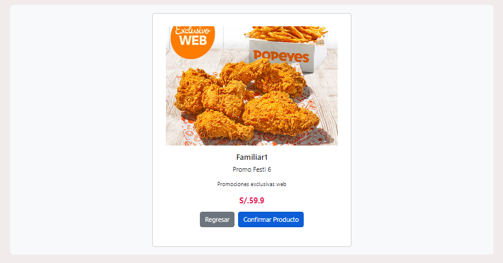
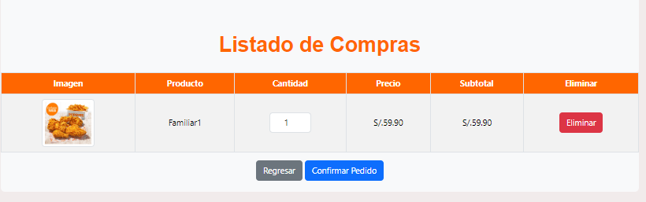
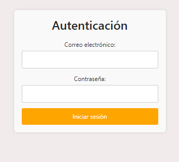
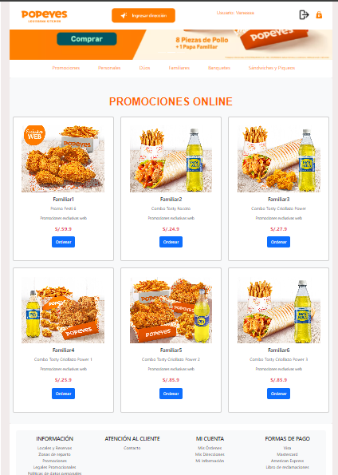

# Proyecto Página Web de Fast Food

Este proyecto es una aplicación web de POPEYES, un fast food desarrollada en React con TypeScript. Permite a los usuarios ver promociones de productos, agregar productos al carrito de compras, realizar pedidos, y ver un resumen detallado de cada pedido realizado.

## Tecnologías Utilizadas

- **React**: Utilizado para construir la interfaz de usuario, incluyendo la navegación entre diferentes secciones como el menú, la lista de productos y el carrito de compras.
- **TypeScript**: Se emplea para añadir tipos estáticos a JavaScript, mejorando la mantenibilidad del código.
- **React Router**: Utilizado para manejar la navegación dentro de la aplicación, permitiendo definir rutas y renderizar componentes dependiendo de la URL.
- **Axios**: Empleado para realizar peticiones HTTP a una API simulada (json-server) y gestionar operaciones como la obtención de productos y la gestión del carrito de compras.
- **Bootstrap**: Framework CSS utilizado para aplicar estilos responsivos y predefinidos a los componentes de la interfaz de usuario.
- **json-server**: Herramienta utilizada para simular un backend REST API y manejar datos como la lista de productos y el carrito de compras.
- **LocalStorage**: API del navegador utilizada para almacenar datos localmente en el navegador del usuario, como los productos agregados al carrito.

## Funcionalidades Principales

### 1. Header y Footer
- **Header**: Navegación principal que incluye enlaces a las distintas secciones de la aplicación.


- **Footer**: Información de contacto y redes sociales.



### 2. Carrusel de Promociones
**CarouselComponent:** Muestra imágenes y promociones destacadas de productos.


### 3. Menú de Navegación
**Menu:** Componente de navegación que muestra diferentes categorías de productos.


### 4. Lista de Productos
**ProductList:** Lista todos los productos disponibles con imagen, nombre, descripción, precio y opción para ordenar.



### 5. Detalle de Producto y Orden
**OrderPage:** Muestra detalles específicos de un producto seleccionado con opción para confirmar y agregar al carrito.


**OrderDetail:** Resumen del pedido mostrando los productos seleccionados, cantidad, precio unitario y subtotal.



### 6. Carrito de Compras

**ShoppingCart:** Permite ver los productos agregados al carrito, ajustar la cantidad de cada producto, eliminar productos y proceder al pago.


### 7. Autenticación
**AuthForm:** Formulario de autenticación para acceder a funciones adicionales como realizar pedidos.



### 8. Estilos y Diseño
Los estilos CSS están diseñados para una experiencia visual atractiva y responsive.
Se utiliza Bootstrap para la maquetación y algunos estilos base.
![Estilos]

### 9. Navegación y Gestión de Estado
- **React Router:** Maneja la navegación entre diferentes páginas y componentes.
- **useState y useEffect:** Utilizados para gestionar y actualizar el estado de los componentes, incluyendo el carrito de compras.

### 10. Integración con Backend Simulado
Se realizan peticiones HTTP con Axios para obtener datos de productos y gestionar el carrito de compras utilizando una API simulada con `json-server`.
Los datos del carrito se almacenan localmente usando `localStorage`.
![Integración con Backend]

### 11. Página Principal y Enrutamiento
- **App.tsx:** Configuración de rutas y enrutamiento de la aplicación.
- **index.tsx:** Punto de entrada de la aplicación React.



### Instalación y Configuración
**Prerrequisitos:**
- Node.js
- npm o yarn

**Pasos para la instalación:**
1. Clona el repositorio:

   ```sh
   git clone https://github.com/vanemarquez/React_FinalProyect
2. Instala las dependencias:
    ```sh
    npm install
    # o
    yarn install
3. Inicia el servidor simulado json-server:
    ```sh
    npx json-server db.json
4. Inicia la aplicación React
   ```sh
    npm start
    # o
    yarn start
La aplicación estará disponible en `http://localhost:3000.`

### Uso
- **Explora las diferentes secciones de la aplicación**, añade productos al carrito, ajusta las cantidades y realiza pedidos.
- **Utiliza el formulario de autenticación** para acceder a funcionalidades adicionales.

### Componentes Clave
- **Header:** Ubicado en `src/components/header/Header.tsx`
- **Footer:** Ubicado en `src/components/footer/Footer.tsx`
- **CarouselComponent:** Ubicado en `src/components/carousel/CarouselComponent.tsx`
- **Menu:** Ubicado en `src/components/menu/Menu.tsx`
- **ProductList:** Ubicado en `src/components/products/ProductList.tsx`
- **OrderPage:** Ubicado en `src/components/order-page/OrderPage.tsx`
- **ShoppingCart:** Ubicado en `src/components/shopping-cart/ShoppingCart.tsx`
- **OrderDetail:** Ubicado en `src/components/order-detail/OrderDetail.tsx`
- **AuthForm:** Ubicado en `src/components/authentication/AuthForm.tsx`


